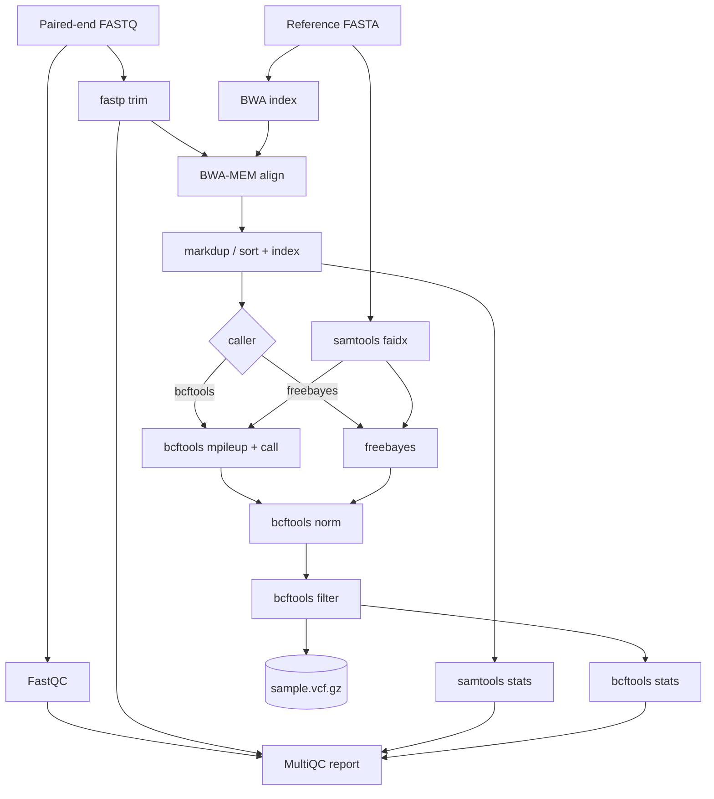

# varcall-nf

[](https://github.com/IvayloKiryazov/varcall-nf/actions/workflows/ci.yml)
[](https://www.nextflow.io/)
[](LICENSE)

A small, **reproducible, tested, and observable** DNA variant-calling pipeline built with
**Nextflow (DSL2)** and one pinned **biocontainer per step**. It takes paired-end reads from
FASTQ to a filtered VCF plus an aggregated QC report, and ships with a self-contained test
dataset so the whole thing runs end-to-end in CI - and asserts the results are
*biologically correct*, not just that it ran.

> A portfolio project demonstrating production-grade engineering practices - reproducibility,
> automated testing, and observability/SLOs - applied to a bioinformatics workflow. The
> [roadmap](docs/ROADMAP.md) tracks planned enhancements across both engineering and analysis.
> AI-assisted implementation; pipeline design and biological interpretation are the author's own.

## What makes it different

Most genomics portfolios stop at "I ran an aligner." This one is built like a production
system:

- **Reproducible** - every tool pinned to a container; Nextflow pinned; deterministic test data.
- **Correctness-tested** - CI asserts the known SNPs are recovered (`bin/check_variants.py`).
- **Reproducibility-tested** - CI runs the pipeline twice and asserts identical calls
  (`bin/compare_vcfs.py`).
- **Observable (SLOs)** - a machine-readable trace is turned into a per-step
  runtime/CPU/memory report with optional budget gating (`bin/pipeline_metrics.py`,
  [`docs/OBSERVABILITY.md`](docs/OBSERVABILITY.md)).
- **Unit-tested + linted** - pytest + ruff on the Python tooling.
- **Swappable science** - choose the variant caller with `--caller` (bcftools | freebayes).

## Workflow



See [`docs/PIPELINE.md`](docs/PIPELINE.md) for what each step does and *why*.

## Requirements

- [Nextflow](https://www.nextflow.io/) `>=23.04.0` (needs Java 17+)
- [Docker](https://www.docker.com/) (containers are pulled automatically)

## Quick start

```bash
# Run the bundled test dataset (no external downloads)
nextflow run . -profile docker,test --outdir results

# Pick a caller
nextflow run . -profile docker,test --caller freebayes --outdir results

# See the SLO-style metrics report
python3 bin/pipeline_metrics.py --trace results/pipeline_info/trace.txt
```

Outputs:

```
results/
├── fastqc/          # per-sample FastQC
├── fastp/           # trimming reports (json/html)
├── alignments/      # dup-marked, sorted, indexed BAMs
├── variants/        # sample1.vcf.gz (+ .tbi) - normalised + filtered
├── stats/           # samtools stats + bcftools stats
├── multiqc/         # multiqc_report.html
└── pipeline_info/   # trace.txt, timeline/report/dag HTML
```

## Parameters

| Param | Default | Description |
|---|---|---|
| `--input` | `assets/samplesheet.csv` | CSV: `sample,fastq_1,fastq_2` |
| `--reference` | bundled 20 kb test genome | Reference FASTA |
| `--caller` | `bcftools` | Variant caller: `bcftools`, `freebayes`, or `gatk` |
| `--trim` | `true` | Adapter/quality trimming with fastp |
| `--mark_duplicates` | `true` | Mark PCR/optical duplicates |
| `--filter_expr` | `QUAL<20 \|\| INFO/DP<10` | bcftools soft-filter expression |
| `--annotate` | `false` | Functional annotation with SnpEff (needs `--annotation`) |
| `--annotation` | `null` | GFF used to build a custom SnpEff DB (matched to `--reference`) |
| `--simulate_reads` | `false` | Simulate reads from `--reference` (see `-profile test_full`) |
| `--outdir` | `results` | Output directory |

### Real-data run (on-demand)

`-profile test_full` downloads the *E. coli* K-12 reference and simulates reads from it, so the
pipeline can be exercised on a real genome without hosting large read files:

```bash
nextflow run . -profile docker,test_full --outdir results_full
```

This is wired as a manually-triggered GitHub Actions workflow
(`.github/workflows/test_full.yml`), mirroring the split between fast gating CI and expensive
integration runs.

For **real sequencing reads**, `-profile test_sra` streams a real *E. coli* run from ENA
(downsampled via `--subsample`) against the K-12 reference (`test_sra.yml`):

```bash
nextflow run . -profile docker,test_sra --outdir results_sra
```

### Joint (cohort) genotyping

The GATK Best-Practices multi-sample workflow (per-sample GVCFs -> CombineGVCFs ->
GenotypeGVCFs), which genotypes every sample at every cohort site:

```bash
nextflow run cohort.nf -profile docker --outdir results_cohort
```

### RNA-seq (second assay)

A separate entry point quantifies transcript expression with Salmon (pseudo-alignment) and
asserts the known expression ranking is recovered:

```bash
nextflow run rnaseq.nf -profile docker --outdir results_rna
```

Run on your own data:

```bash
nextflow run . -profile docker \
    --input mysamples.csv --reference /path/to/genome.fa --outdir results
```

## The test dataset

`bin/generate_test_data.py` deterministically builds a 20 kb reference (shared via
`--ref-seed`) and, per sample, mutates a copy with 10 known SNPs and simulates ~40x paired-end
reads from it. The bundled dataset has **two samples** (`sample1`, `sample2`) sharing one
reference. Aligning back to the *unmutated* reference should recover exactly each sample's
SNPs - which is what CI asserts for every sample.

## Tests & CI

Three CI jobs run on every push/PR:

1. **quality** - `ruff` lint + `pytest` on the Python tooling.
2. **test** - runs the pipeline for each caller (`bcftools`, `freebayes`) and asserts the known
   SNPs are recovered; publishes a metrics summary.
3. **reproducibility** - runs the pipeline twice and asserts identical variant calls.

Locally:

```bash
python3 -m venv .venv && . .venv/bin/activate
pip install -r requirements-dev.txt
ruff check bin tests && pytest
```

## Docs

- [`docs/GLOSSARY.md`](docs/GLOSSARY.md) - plain-language definitions of every term.
- [`docs/PIPELINE.md`](docs/PIPELINE.md) - step-by-step design & decisions.
- [`docs/DESIGN_AND_BIOLOGY.md`](docs/DESIGN_AND_BIOLOGY.md) - deeper biology + rationale (DNA & RNA).
- [`docs/OBSERVABILITY.md`](docs/OBSERVABILITY.md) - the SLO/metrics angle.
- [`docs/LEARNING_PATH.md`](docs/LEARNING_PATH.md) - domain references + concept-to-code map.
- [`docs/EXERCISES.md`](docs/EXERCISES.md) - progressive hands-on exercises.
- [`docs/ROADMAP.md`](docs/ROADMAP.md) - themed backlog + milestones.
- [`docs/RELEASING.md`](docs/RELEASING.md) - versioning policy and release checklist.
- [`nextflow_schema.json`](nextflow_schema.json) - documented parameter schema.
- [`AGENTS.md`](AGENTS.md) - guide for AI agents / contributors, plus `.agents/skills/`.

## License

MIT - see [LICENSE](LICENSE).
