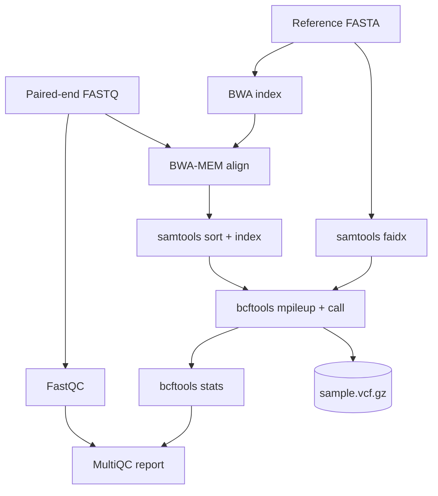

# varcall-nf

[](https://github.com/IvayloKiryazov/varcall-nf/actions/workflows/ci.yml)
[](https://www.nextflow.io/)
[](LICENSE)

A tiny, fully reproducible **DNA variant-calling pipeline** built with **Nextflow (DSL2)**
and one **biocontainer per step**. It takes paired-end reads from FASTQ all the way to a
filtered VCF and an aggregated QC report, and it ships with a self-contained test dataset so
the whole thing runs end-to-end in CI on every push.

This is a learning / portfolio project: the goal is a small but *correct* and *reproducible*
genomics workflow that mirrors how real pipeline/bioinformatics-engineering work is done
(containers, workflow manager, bundled test data, CI that asserts scientific correctness).

## Workflow



| Step | Tool | Container |
|---|---|---|
| Read QC | FastQC | `fastqc:0.12.1` |
| Reference index | BWA | `bwa:0.7.17` |
| Reference faidx | samtools | `samtools:1.17` |
| Alignment | BWA-MEM | `bwa:0.7.17` |
| Sort + index | samtools | `samtools:1.17` |
| Variant calling | bcftools | `bcftools:1.17` |
| Variant stats | bcftools | `bcftools:1.17` |
| Aggregate QC | MultiQC | `multiqc:1.19` |

## Requirements

- [Nextflow](https://www.nextflow.io/) `>=23.04.0` (needs Java 17+)
- [Docker](https://www.docker.com/) (containers are pulled automatically)

## Quick start

Run the bundled test dataset (no external downloads):

```bash
nextflow run . -profile docker,test --outdir results
```

Outputs land in `results/`:

```
results/
├── fastqc/                 # per-sample FastQC reports
├── alignments/             # sorted, indexed BAMs
├── variants/               # sample1.vcf.gz (+ .tbi)
├── stats/                  # bcftools stats
├── multiqc/                # multiqc_report.html
└── pipeline_info/          # execution timeline + report
```

## Run on your own data

Point the pipeline at your own samplesheet and reference:

```bash
nextflow run . -profile docker \
    --input mysamples.csv \
    --reference /path/to/genome.fa \
    --outdir results
```

`--input` is a CSV with a header and one row per sample:

```csv
sample,fastq_1,fastq_2
sample1,/path/to/sample1_R1.fastq.gz,/path/to/sample1_R2.fastq.gz
```

## The test dataset

`bin/generate_test_data.py` deterministically builds a 20 kb reference, mutates a copy of it
with 10 known SNPs, and simulates ~40x paired-end reads from the mutated copy. Because the
reads are aligned back to the *unmutated* reference, the pipeline should recover exactly those
10 SNPs — which is what `bin/check_variants.py` asserts in CI. Regenerate with:

```bash
python3 bin/generate_test_data.py
```

## Continuous integration

On every push/PR, GitHub Actions installs Nextflow, runs the pipeline with `-profile docker,test`,
and then runs `check_variants.py` to confirm all known SNPs were called. CI is green only if the
pipeline both **runs** and produces the **biologically correct** result.

## Ideas / roadmap

- Variant annotation (SnpEff / VEP) and filtering thresholds.
- Multi-sample joint calling; support for BED target regions.
- Swap the caller (GATK HaplotypeCaller / DeepVariant) behind a `--caller` param.
- `nf-test` unit tests per module; `-profile conda` as an alternative to Docker.

## License

MIT - see [LICENSE](LICENSE).
